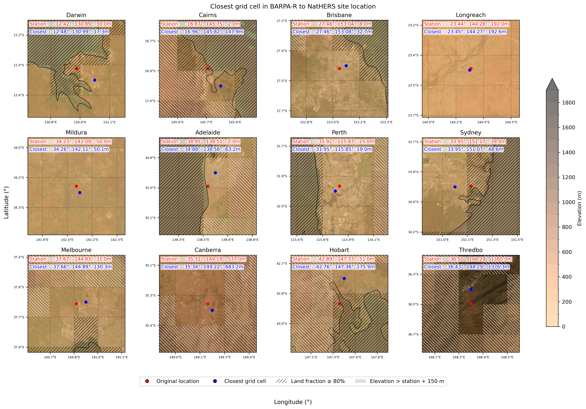

# NESP BFF – NatHERS Climate Data Processing Pipeline

Processing pipeline for generating bias-corrected hourly climate datasets compatible with NatHERS weather variables from BARPA-R regional climate simulations.

The workflow extracts climate model variables at specific locations and applies bias correction using a Quantile Delta Change (QDC) method to produce datasets suitable for building energy modelling and climate impact analysis.

The pipeline is designed to run on NCI Gadi and uses PBS job scripts to process multiple models, locations, and time periods efficiently.

## Table of contents

- [Important notes on environment and configuration](#️-important-notes-on-environment-and-configuration)
  - [Conda environment compatibility](#conda-environment-compatibility)
  - [Hard-coded file paths](#hard-coded-file-paths)
- [Repository structure with relevant files](#repository-structure-with-relevant-files)
- [Workflow overview](#workflow-overview)
- [Step 1 – Extraction of climate variables](#step-1--extraction-of-climate-variables)
- [Step 2 – Bias correction using Quantile Delta Change (QDC)](#step-2--bias-correction-using-quantile-delta-change-qdc)
- [Step 3 – Derived variables, unit conversion and dataset completion](#step-3--derived-variables-unit-conversion-and-dataset-completion)
- [Running the pipeline on NCI Gadi](#running-the-pipeline-on-nci-gadi)
- [Requirements](#requirements)
- [Outputs](#outputs)
- [Original/outdated documentation](#originaloutdated-documentation)
- [Authors](#authors)

### ⚠️ **Important notes on environment and configuration**

#### Conda environment compatibility

This pipeline currently **does not run with the newest `analysis3` conda environments on NCI Gadi**.

The scripts depend on the **`xclim.sdba`** module, which was previously part of the `xclim` package.  
In newer `analysis3` environments, this functionality has been moved to a separate package **`xsdba`**, which is **not yet supported by this repository**.

As a result:

- **`analysis3-25.09` or earlier environments will run the pipeline successfully**, but may display deprecation warnings.
- **Newer environments will fail with an import error** because `xclim.sdba` is no longer available.

For now, please use:

```
module load conda/analysis3-25.09
```
The appropriate conda environent is automatically loaded when job scripts are submitted.
Work is underway to update the scripts to support the newer **`xsdba`** package. Once this migration is complete, the repository will be updated accordingly.


#### Hard-coded file paths

Some scripts currently contain **hard-coded file paths**, for example when importing shared utilities:

```python
sys.path.append("/home/565/dh4185/mn51-dh4185/repos_collab/nesp_bff/")
import utils
```
These paths may need to be updated to match your local environment or repository location.
Improving portability and removing hard-coded paths is part of ongoing development.


---

## Repository structure with relevant files

```
nesp_bff/
│
├── utils.py                 # shared functions used across the pipeline
│
├── step1_extracting_variables.py           # Step 1 – extraction of climate variables
├── run_step2_qdc_scaling.py                # Step 2 – QDC bias correction
├── run_step3_calc_missing_vars.py          # Step 3 – derived variables, convert units and final outputs
│
├── pbs_scripts/                            # Bash and PBS scripts for running jobs on NCI Gadi
│   ├── submit_all_gcms_step1.sh
│   ├── submit_step2_qdc_jobs.sh
│   ├── submit_step3_by_location.sh
│   ├── pbs_step1_parallel
│   ├── pbs_qdc_step2
│   └── pbs_step3_calc_missing
│
├── notebooks/               # exploratory analysis and validation notebooks
│
└── docs/
    └── Readme.txt           # original project documentation
```

---

## Workflow overview

The processing pipeline converts **regional climate model output** into **location-specific hourly time series of NatHERS weather variables**.

The workflow consists of three main steps:

```
BARPA-R climate model output
            │
            ▼
Step 1 – Extract variables at locations
            │
            ▼
Step 2 – Apply QDC bias correction
            │
            ▼
Step 3 – Compute derived variables and final datasets
            │
            ▼
NatHERS-compatible hourly climate files for further processing to TMY and XMY files
```

---

## Step 1 – Extraction of climate variables

Scripts:

```
step1_extracting_variables.py
```

Purpose:

Extract climate variables from the **BARPA-R regional climate model grid** to predefined station or location coordinates.
For a list of GCMs and ensemble member see: [Readme.txt](docs/Readme.txt)
Emission scenarios include ssp126 and ssp370 for 20-year time periods centred around 2030, 2050, and 2070.

### Grid cell selection

Locations are mapped to the **closest eligible grid cell**, using constraints to ensure realistic representation:

* minimum **land fraction threshold**
* elevation compatibility between the station and grid cell
* nearest available grid point satisfying these conditions

This avoids selecting grid cells that represent ocean points or unrealistic terrain elevations.



### Extracted variables

The extracted variables correspond to those required in **NatHERS weather files**, or can be calcualted from those.

* air temperature ('tas')
* specific humidity ('huss')
* wind speed and direction ('sfcWind', 'uas', 'vas')
* sea level pressure ('psl') 
* solar radiation components ('rsdsdir', 'rsdsdif')
* Cloud cover ('clt') 

The result is a set of **location-specific hourly NetCDF files** for each climate model and scenario, saved in this directory:
```
/g/data/eg3/nesp_bff/step1_raw_data_extraction/BARPA-R/
```

Execution on Gadi:

```
bash pbs_scripts/submit_all_gcms_step1.sh
```

---

## Step 2 – Bias correction using Quantile Delta Change (QDC)

Scripts:

```
run_step2_qdc_scaling.py
```

Purpose:

Apply **bias correction** to climate model variables using the **Quantile Delta Change (QDC)** method.
The QDC approach preserves projected climate change signals while adjusting the distribution of model outputs to better match observed climatology (Irving & Macadam 2024). 
Bias correction is applied relative to a NatHERS historical files as the reference dataset. For radiation variables, bias-adjusted values at solar altitude angles below 10° are replaced with the corresponding observational values to avoid artefacts near sunrise and sunset.

### QDC methodology

The following variables are bias-corrected:

* tas
* huss
* sfcWind
* psl
* rsds


Key characteristics of the implementation:

* applied at **hourly resolution** using a **+/- 1 hour sliding temporal window** for smooth transitioning between hours
* quantile mapping performed using 100 quantiles, allowing the bias correction to capture distributional differences between model and observations while maintaining robust quantile estimation given the available sample size (175320 hourly time steps)
* independently for each location and model

Variables Not Bias Corrected:

The following variables are currently not bias corrected due to methodological limitations:

| Variable       | Reason                                                  |
| -------------- | ------------------------------------------------------- |
| clt            | NatHERS cloud cover is reported in octas (ordinal cate- |
|                | gorical data), which is not compatible with the contin- |
|                | uous quantile mapping approach used here.               |
| wind direction | Circular variable requiring specialised bias correction |

These variables are therefore retained directly from the NatHERS data.
This limitation should be considered when interpreting prototype results.

Output files are saved in directory:
```
/g/data/eg3/nesp_bff/step2_qdc_scaling/BARPA-R/
```

Execution on Gadi:

```
bash pbs_scripts/submit_step2_qdc_jobs.sh
```

---

## Step 3 – Derived variables, unit conversion and dataset completion

Scripts:

```
run_step3_calc_missing_vars.py
```

Purpose:

Compute derived meteorological variables and convert units where necessary to ensure that the final dataset contains the full set of variables required for **NatHERS weather files**.
Some variables required in NatHERS datasets are not directly available in the climate model output and must therefore be calculated.

* consistency checks between radiation components
* calculation of **Direct Normal Irradiance (DNI)**
* binning cloud fraction to oktas

Variables are converted to units required by the NatHERS weather file format.

| Variable            | Conversion        |
| ------------------- | ----------------- |
| Temperature         | Kelvin → °C       |
| Specific humidity   | kg/kg → g/kg      |
| Radiation           | retained as W m⁻² |
| Wind speed          | retained as m/s   |
| Atmospheric pressure| kPa → Pa          |


The final output are **complete hourly dataset of NatHERS climate variables** for each location, emssion scenario and time period in directory:
```
/g/data/eg3/nesp_bff/step3_calc_missing_vars/
```

Execution on Gadi:
```
bash pbs_scripts/submit_step3_by_location.sh
```

---

## Running the pipeline on NCI Gadi

Each processing step is executed using bash scripts located in:
```
pbs_scripts/
```

These scripts call individual jobs submission with the PBS job scheduler and typically distribute jobs across:

* climate models
* scenarios
* locations
* time periods

to efficiently process large datasets.

---

## Requirements

Typical Python dependencies include:

```
xarray
numpy
pandas
scipy
netCDF4
dask
xclim
```

The workflow is designed to run within the **analysis3-25.09 environment on NCI Gadi**.

Example:

```
module use /g/data/xp65/public/modules
module load conda/analysis3-25.09
```
The appropriate conda environent is automatically loaded when job scripts are submitted.

---

## Outputs

The final output consists of **bias-corrected hourly NetCDF files** for each:

* location
* climate model
* scenario
* time period

containing a complete set of NatHERS weather variables, including flags.

These datasets can be used for further processing through TMY and XMY pipelines.

---

## Original/outdated documentation

The original project README.md documentation is archived here:

```
docs/README_old.md
```

---

## Authors

Developed as part of the **NESP Building Futures Framework (BFF)** project to produce climate datasets for building energy modelling.

---

